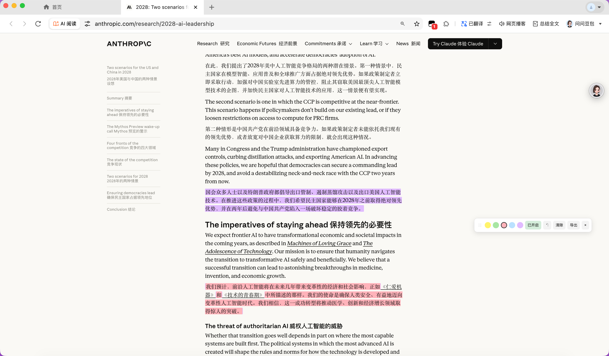
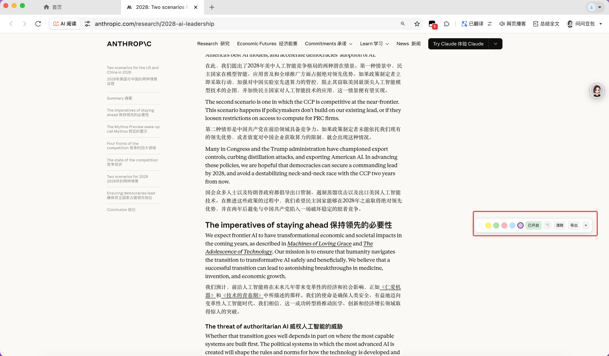

# Web Highlighter

> A lightweight Chrome extension for highlighting and annotating any web page. Persistent, draggable, keyboard-friendly. No account, no cloud, no tracking.
>
> 一款轻量的 Chrome 网页高亮标注扩展。框选即高亮，按域名+路径自动持久化，支持笔记、撤销、侧边栏目录。无账号、无云端、无追踪。

[English](#english) · [中文](#中文) · [Changelog](CHANGELOG.md) · [License](LICENSE)

---

## 中文

### 截图

| 工具栏 | 多色高亮 |
|---|---|
|  |  |

### 特性

- **框选即高亮** —— 选中文字立即用当前默认色高亮，不打扰阅读
- **5 种预设色** —— 黄 / 绿 / 粉 / 蓝 / 紫，工具栏一键切换默认色
- **持久化保存** —— 按 `域名 + 路径` 自动存到本地，刷新 / 关浏览器都还在
- **笔记批注** —— 给任意高亮加一段文字笔记，鼠标悬停查看
- **侧边栏目录** —— 一键展开本页所有标注，点条目滚动到原位 + 闪烁定位
- **撤销** —— `⌘/Ctrl + Shift + Z` 撤销最近 50 步操作（新增、改色、删除、写笔记、清空）
- **改色 / 删除** —— 点已有高亮弹出面板，可改色、删除、写笔记
- **拖动工具栏** —— 工具栏可拖到任意位置，位置自动记忆
- **导出 JSON** —— 一键导出本页全部高亮和笔记
- **完全本地** —— 所有数据存在 `chrome.storage.local`，**不上传任何服务器**

### 安装（开发者模式）

1. 下载本仓库（`Code` → `Download ZIP`，或 `git clone`）
2. 打开 Chrome 地址栏：`chrome://extensions/`
3. 右上角打开「**开发者模式**」
4. 点「**加载已解压的扩展程序**」，选择本仓库根目录
5. 任意网页刷新，右下角出现工具栏即装好

### 使用

| 操作 | 方式 |
|---|---|
| 高亮文字 | 用鼠标框选，松开即高亮 |
| 切换默认色 | 点工具栏上的色块 |
| 改色 / 删除 / 加笔记 | 点已有高亮，弹出面板 |
| 撤销 | `⌘/Ctrl + Shift + Z` 或工具栏 ↶ |
| 打开侧边栏目录 | 工具栏 ☰ |
| 显示 / 隐藏工具栏 | 点扩展图标，或 `Alt + H` |
| 拖动工具栏 | 按住左侧 ⋮⋮ 拖动 |
| 清空本页全部高亮 | 工具栏「清除」（可撤销） |
| 导出 JSON | 工具栏「导出」 |
| 关闭高亮功能 | 工具栏「已开启 / 已关闭」 |

### 隐私

- 所有高亮、笔记、设置只存在你**本机**的 `chrome.storage.local` 中
- **从不**联网、**从不**上报、**从不**收集任何数据
- 扩展请求 `<all_urls>` 权限只是为了让你能在任意网页使用高亮功能
- 源码完全开放，欢迎自行审计

### 技术原理

- 高亮通过把选中范围的文本节点拆分包裹在 `` 中实现
- 持久化时记录原文 + 前后 20 字符上下文；恢复时在 DOM 文本中匹配定位
- 支持跨多个 inline 元素的选区（按文本节点逐个包裹）
- 不依赖任何第三方库，纯原生 JS / CSS，代码 < 500 行

### 已知限制

- 特殊页面（`chrome://`、Chrome Web Store、PDF 内嵌阅读器）浏览器禁止注入
- 网页原文被改 / 翻译 / 大幅重排后，标注可能定位失败
- SPA 路由切换不会自动 restore，需要手动刷新
- 同一段文字多处出现时，恢复用上下文匹配第一处

### 路线图

- [ ] Options page：跨页面高亮看板，按域名 / 时间分组
- [ ] 导出 Markdown / 复制为引用块
- [ ] 锚点 fallback：除了文本匹配再加 XPath / CSS selector
- [ ] SPA 路由变化自动 restore
- [ ] 截图导出（含高亮）
- [ ] 多语言（i18n）

### 贡献

欢迎 issue 和 PR。提交前请：

1. 在干净的 Chrome profile 上手动测一遍主流程
2. 改动若涉及高亮恢复逻辑，请在至少 3 个不同结构的网页上验证
3. 遵循现有代码风格（无构建步骤、无依赖、纯原生）

### 许可

[MIT](LICENSE)

---

## English

### Features

- **Select-to-highlight** — Selecting text instantly applies the current color
- **5 preset colors** — Yellow / Green / Pink / Blue / Purple
- **Persistent** — Saved per `host + path`, survives reload and browser restart
- **Notes** — Attach a text note to any highlight, shown on hover
- **Sidebar TOC** — One-click panel listing all highlights on the page; click to scroll + flash
- **Undo** — `Cmd/Ctrl + Shift + Z` for last 50 actions
- **Recolor / delete** — Click any highlight to open the inline editor
- **Draggable toolbar** — Position is remembered
- **JSON export** — Export all highlights and notes for the current page
- **Local-only** — All data stays in `chrome.storage.local`, no network calls

### Install (unpacked)

1. Download or clone this repo
2. Open `chrome://extensions/`
3. Enable **Developer mode** (top right)
4. Click **Load unpacked** and select the repo folder
5. Reload any web page; the toolbar appears in the bottom-right corner

### Privacy

This extension makes **zero network requests**. All highlights, notes, and settings are stored in `chrome.storage.local` on your device only. The `<all_urls>` host permission exists solely to let you highlight on any page. Source code is fully open for audit.

### How it works

Highlights are implemented by splitting text nodes within the selection range and wrapping them in ``. For persistence, each mark stores the original text plus 20 characters of surrounding context; on page load, marks are restored by locating that text in the live DOM. No external libraries; pure vanilla JS/CSS in under 500 lines.

### Limitations

- Cannot inject into restricted pages (`chrome://`, Chrome Web Store, embedded PDF viewer)
- Highlights may fail to restore if the original page text changes significantly
- SPA route changes do not auto-restore; manual reload required
- When the same text appears multiple times, restoration matches the first occurrence using context

### License

[MIT](LICENSE)
