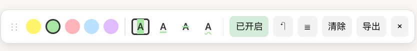

# Web Highlighter

> 一款轻量的 Chrome 网页高亮标注扩展。框选即高亮，按域名+路径自动持久化，支持笔记、撤销、侧边栏目录、SPA 路由自适应。无账号、无云端、无追踪。

**语言：** [English](README.md) · [简体中文](README.zh-CN.md)
**链接：** [更新日志](CHANGELOG.md) · [许可证](LICENSE) · [最新版本](https://github.com/shyenx/web-highlighter/releases/latest)

## 截图

**v0.2.0 工具栏（含 4 种标注样式）**

| 工具栏 (v0.1) | 多色高亮 |
|---|---|
|  |  |

## 特性

- **框选即高亮** —— 选中文字立即用当前默认色 + 当前样式标注，不打扰阅读
- **4 种标注样式** —— 背景色 / 下划线 / 删除线 / 波浪线，工具栏即时切换
- **5 种预设色** —— 黄 / 绿 / 粉 / 蓝 / 紫
- **中英双语界面** —— 工具栏一键切换 EN / 中
- **持久化保存** —— 按 `域名 + 路径` 自动存到本地，刷新 / 关浏览器都还在
- **SPA 自适应** —— 工具栏和标注在 React / Vue / Next.js 站点的客户端导航后依然保留
- **UI 自愈** —— 工具栏被页面 DOM 操作移除会自动重新挂回
- **笔记批注** —— 给任意高亮加一段文字笔记，鼠标悬停查看
- **侧边栏目录** —— 一键展开本页所有标注，点条目滚动到原位 + 闪烁定位
- **撤销** —— `⌘/Ctrl + Shift + Z` 撤销最近 50 步操作
- **改色 / 改样式 / 删除** —— 点已有高亮弹出面板
- **拖动工具栏** —— 可拖到任意位置，位置自动记忆
- **导出 JSON** —— 一键导出本页全部高亮和笔记
- **完全本地** —— 所有数据存在 `chrome.storage.local`，**不上传任何服务器**

## 安装（开发者模式）

1. 下载最新 [Release zip](https://github.com/shyenx/web-highlighter/releases/latest)，或 `git clone` 本仓库
2. 打开 Chrome 地址栏：`chrome://extensions/`
3. 右上角打开「**开发者模式**」
4. 点「**加载已解压的扩展程序**」，选择解压后的目录
5. 任意网页刷新，右下角出现工具栏即装好

## 使用

| 操作 | 方式 |
|---|---|
| 高亮文字 | 用鼠标框选，松开即高亮 |
| 切换默认色 | 点工具栏上的色块 |
| 切换默认样式 | 点工具栏上的样式按钮（`A`, `A̲`, `A̶`, `A̰`） |
| 改色 / 改样式 / 删除 | 点已有高亮（不拖动）弹出面板 |
| 加 / 改笔记 | 点高亮 → 在 textarea 输入 → `⌘/Ctrl + Enter` 保存 |
| 打开侧边栏目录 | 工具栏 `☰` |
| 撤销 | `⌘/Ctrl + Shift + Z` 或工具栏 `↶` |
| 显示 / 隐藏工具栏 | 点扩展图标，或 `Alt + H` |
| 拖动工具栏 | 按住左侧 `⋮⋮` 拖动 |
| 清空本页全部高亮 | 工具栏「清除」（可撤销） |
| 导出 JSON | 工具栏「导出」 |
| 关闭高亮功能 | 工具栏「已开启 / 已关闭」 |
| 切换 UI 语言 | 工具栏 `EN / 中` 按钮 |

## 隐私

- 所有高亮、笔记、设置只存在你**本机**的 `chrome.storage.local` 中
- **从不**联网、**从不**上报、**从不**收集任何数据
- 扩展请求 `<all_urls>` 权限只是为了让你能在任意网页使用高亮功能
- 源码完全开放，欢迎自行审计

## 技术原理

- 高亮通过把选中范围的文本节点拆分包裹在 `` 中实现
- 持久化时记录原文 + 前后 20 字符上下文；恢复时在 DOM 文本中匹配定位
- SPA 通过拦截 `history.pushState / replaceState` + 监听 `popstate / hashchange` 检测路由变化
- 工具栏自愈靠 `MutationObserver` 监听 body 移除事件
- 不依赖任何第三方库，纯原生 JS / CSS

## 已知限制

- 特殊页面（`chrome://`、Chrome Web Store、PDF 内嵌阅读器）浏览器禁止注入
- 网页原文被改 / 翻译 / 大幅重排后，标注可能定位失败
- 同一段文字多处出现时，恢复用上下文匹配第一处

## 路线图

- [ ] Options page：跨页面高亮看板，按域名 / 时间分组
- [ ] 导出 Markdown / 复制为引用块
- [ ] 锚点 fallback：除了文本匹配再加 XPath / CSS selector
- [x] SPA 路由变化自动 restore（v0.3.0）
- [x] 中英双语 UI（v0.4.0）
- [ ] 截图导出（含高亮）

## 贡献

欢迎 issue 和 PR。提交前请：

1. 在干净的 Chrome profile 上手动测一遍主流程
2. 改动若涉及高亮恢复逻辑，请在至少 3 个不同结构的网页上验证
3. 遵循现有代码风格（无构建步骤、无依赖、纯原生）

## 许可

[MIT](LICENSE)
